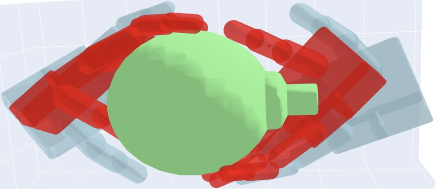

# Projet de Fin d'Étude au CEA-LIST

Ce stage respect une clause confidentialité industrielle (mon encadrant tient à la possibilité de breveter le travail effectué).

Ainsi je ne suis pas en mesure de diffuser mon rapport de stage.
De même, les codes de la méthode développée ne sont pas disponible sur ce répertoire.

## Travail effectué

L'objectif de ce stage était de concevoir une méthode générant des préhensions pluri-digitales d’objets partiellement perçus (perception depuis un point de vue d'une caméra profondeur).

Après étude de la préhension robotique, et identification des approches les plus prometteuses ainsi que leurs limites, 
nous proposons la méthode *IronMan* (voir les slides de présentation pour plus d'information).

## Publications étudiées

Voir 'documents/papers-notes.md'.

## Méthodes étudiées

- [DexGraspNet](https://github.com/PKU-EPIC/DexGraspNet)
- [GenDexGrasp](https://github.com/tengyu-liu/GenDexGrasp)
- [dgrasp](https://github.com/christsa/dgrasp)
- [graspd](https://github.com/dylanturpin/graspd)
- [contact_graspnet](https://github.com/NVlabs/contact_graspnet)
- [pointnet2_pytorch](https://github.com/yanx27/Pointnet_Pointnet2_pytorch)
